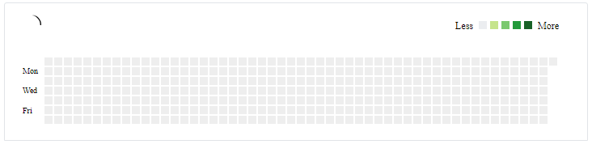

# Team contribution calendar

#### GitHub-like contribution calendar for the whole team. Supports GitHub and GitLab.



Status and support

- &#x2714; stable
- &#x2714; supported
- &#x2714; ongoing development

<!--- Version information -->
*You are viewing the README of the development version. Latest version: [v0.3.1](/../../tree/v0.3.1)*
<!--- Version information end -->

[](https://github.com/c-hive/team-contribution-calendar/actions)
[](https://coveralls.io/github/c-hive/team-contribution-calendar?branch=master)
[](https://badge.fury.io/js/%40c-hive%2Fteam-contribution-calendar)
[](https://www.npmjs.com/package/@c-hive/team-contribution-calendar)

### Usage

#### As dependency

```
yarn add @c-hive/team-contribution-calendar
```

We recommend using `yarn` because of [compatibility](https://github.com/c-hive/team-contribution-calendar/issues/55).

#### Via CDN

```html
<script type="text/javascript" src="https://cdn.jsdelivr.net/gh/c-hive/team-contribution-calendar@0.2.0/dist/team-contribution-calendar.min.js">
</script>
```

#### Examples

Create your [CORS proxy server](https://github.com/Rob--W/cors-anywhere).

##### As dependency

```javascript
import TeamContributionCalendar from "@c-hive/team-contribution-calendar";

const container = document.getElementById("container");
const ghUsernames = [{ name: "gaearon" }, { name: "tenderlove", from: "2020-01-20" }, { name: "thisismydesign", from: "2020-01-20", to: "2020-03-20" }];
const glUsernames = [{ name: "gnachman" }, { name: "sytses", from: "2020-01-20" }];

TeamContributionCalendar(container, ghUsernames, glUsernames, "https://your-proxy-server.com/");
```

##### Via CDN

```html
<div class="container"></div>
<script>
  const ghUsernames = [{ name: "gaearon" }, { name: "tenderlove", from: "2020-01-20" }, { name: "thisismydesign", from: "2020-01-20", to: "2020-03-20" }];
  const glUsernames = [{ name: "gnachman" }, { name: "sytses", from: "2020-01-20" }, { name: "gomorizsolt", to: "2020-04-03" }];
  TeamContributionCalendar(".container", ghUsernames, glUsernames, "https://your-proxy-server.com/");
</script>
```

## Conventions

This project follows [C-Hive guides](https://github.com/c-hive/guides) for code style, way of working and other development concerns.

## License

The package is available as open source under the terms of the [MIT License](http://opensource.org/licenses/MIT).
