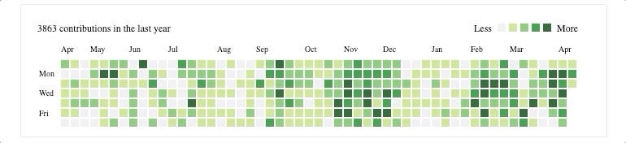

# Team contribution calendar

#### GitHub-like contribution calendar for the whole team. Supports GitHub and GitLab.



Status and support

- &#x2716; work in progress
- &#x2714; supported
- &#x2714; ongoing development

### Usage

#### NPM

```
npm install --save @c-hive/team-contribution-calendar
```

#### CDN


```html
<script type="text/javascript" src="https://cdn.jsdelivr.net/gh/c-hive/team-contribution-calendar/dist/team-contribution-calendar.min.js">
</script>
```

#### Config

<pre>
<b>TeamContributionCalendar(container, gitHubUsers, gitLabUsers, proxyServerUrl)</b>
</pre>

Required params:
- `container`: a DOM element in which the calendar will be rendered,
- `gitHubUsers` / `gitLabUsers`: array of users(at least one user should be presented in either of them).

Optional param:
- `proxyServerUrl`: CORS proxy url(we serve one by default).

#### Examples

##### NPM

```script
import TeamContributionCalendar from "@c-hive/team-contribution-calendar";

const container = document.getElementById('container');

// For further examples, see the CDN section below.
TeamContributionCalendar(container, ['gh_username'], []);
```

##### CDN

```html
<div class="container"></div>
<script>
   // Empty GitLab users, without the optional param.
   TeamContributionCalendar('.container', ['gh_username']);
</script>
```

```html
<div class="container"></div>
<script>
   // Empty GitHub users, without the optional param.
   TeamContributionCalendar('.container', [], ['gl_username_one', 'gl_username_two']);
</script>
```

```html
<div class="container"></div>
<script>
   // Passing both GitHub and GitLab users along with a cors-proxy url.
   TeamContributionCalendar('.container', ['gh_username_one', 'gh_username_two'], ['gl_username'], 'https://proxy-server-url.com');
</script>
```